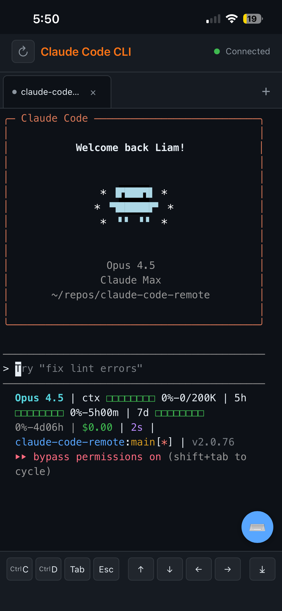

# Claude Code Remote

A mobile-optimized web interface for running [Claude Code CLI](https://claude.ai/code) remotely on a Raspberry Pi, accessible from your iPhone or any device on your Tailscale network.

<p align="center">
  
</p>

## Why?

Claude Code CLI is powerful but requires a terminal. This project lets you:

- **Code from anywhere** - Use Claude Code from your iPhone, iPad, or any browser
- **Keep sessions alive** - Sessions persist on the Pi even when you disconnect
- **Stay secure** - No exposed ports; Tailscale-only access with HTTPS

## Features

- 📱 **Mobile-first UI** - Touch-optimized with virtual control bar (Ctrl+C, Tab, arrows, etc.)
- 🔒 **Secure by default** - Tailscale network-only access with HTTPS via Tailscale Serve
- 💻 **Multi-session tabs** - Up to 3 concurrent Claude sessions
- ⚡ **Real-time terminal** - WebSocket-based streaming with xterm.js
- 🎨 **Dark theme** - Easy on the eyes, GitHub-style colors
- 📂 **Repo management** - List, clone, and create repositories from the UI

## Architecture

```
iPhone/Browser                         Raspberry Pi 5
+-----------------+    Tailscale      +----------------------+
|                 |<---- HTTPS ------>|                      |
|  xterm.js       |                   |  Fastify server      |
|  Touch UI       |<-- WebSocket ---->|  node-pty            |
|  Control bar    |                   |  Claude Code CLI     |
+-----------------+                   +----------------------+
```

## Quick Start

### Prerequisites

- Raspberry Pi (tested on Pi 5) with Node.js 18+
- [Tailscale](https://tailscale.com/) installed on Pi and your devices
- [Claude Code CLI](https://claude.ai/code) installed on the Pi

### Installation

```bash
# SSH into your Pi
ssh pi@<your-pi-tailscale-ip>

# Clone the repo
git clone https://github.com/liam-machine/claude-code-remote.git
cd claude-code-remote

# Install dependencies
npm install

# Start the server
npm run dev
```

### Enable HTTPS (Recommended for iOS Safari)

Safari blocks WebSocket connections to raw IP addresses. Use Tailscale Serve for HTTPS:

```bash
# On the Pi - enable Tailscale Serve
sudo tailscale serve --bg 3000

# Now access via HTTPS
https://<your-pi-hostname>.tail<xxxxx>.ts.net/
```

Find your hostname with `tailscale status`.

### Access

Open in your browser:
- **HTTPS (recommended)**: `https://<pi-hostname>.ts.net/`
- **Direct IP**: `http://<pi-tailscale-ip>:3000`

## Usage

1. **Create a session** - Click the `+` button to start a new Claude session
2. **Select a repo** - Choose which repository Claude should work in
3. **Start coding** - Claude Code CLI launches automatically
4. **Use the control bar** - Tap virtual keys for Ctrl+C, Tab, arrows, etc.
5. **Switch sessions** - Use tabs to manage multiple sessions

## Tech Stack

| Component | Technology |
|-----------|------------|
| Server | Node.js + Fastify |
| WebSocket | ws library |
| PTY | node-pty |
| Terminal | xterm.js |
| Frontend | Vanilla JS (no build step) |
| Security | Tailscale + Tailscale Serve |

## Configuration

Environment variables (optional):

```bash
PORT=3000              # Server port
REPOS_DIR=~/repos      # Repository directory
MAX_SESSIONS=3         # Maximum concurrent sessions
```

## Security

- **No exposed ports** - Only accessible via Tailscale network
- **HTTPS encryption** - Via Tailscale Serve (automatic TLS certificates)
- **No authentication layer** - Relies on Tailscale device authorization
- **Sandboxed sessions** - Each session runs in its own PTY

## License

MIT
